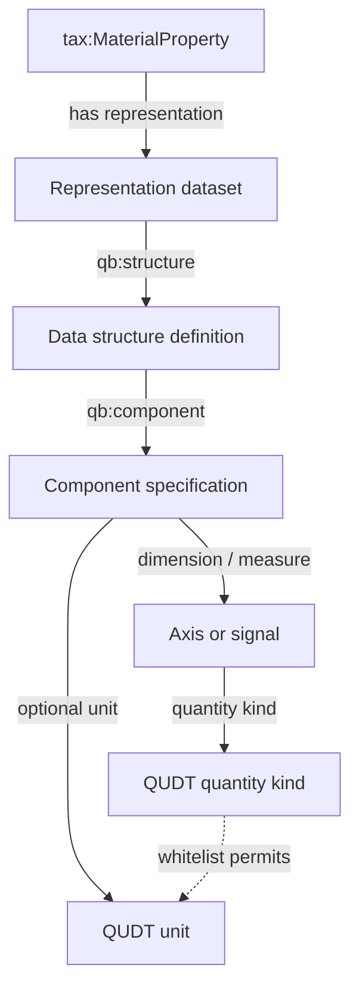
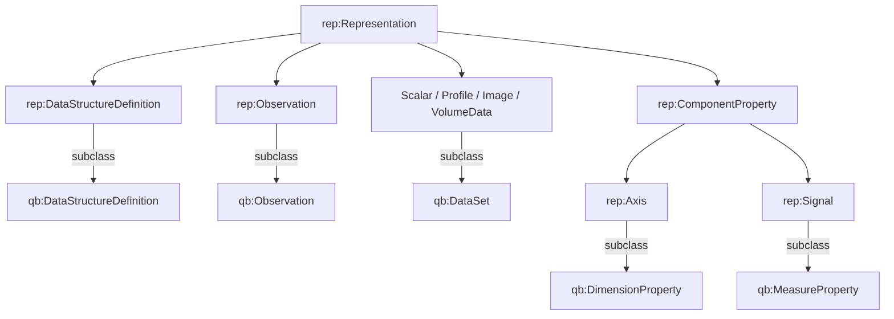
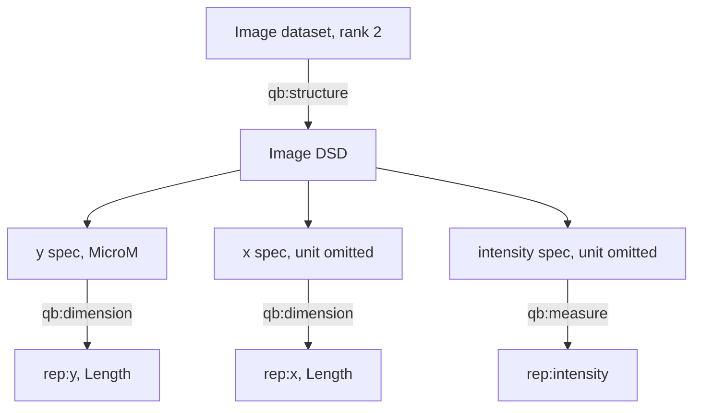

# Ontology overview

The solid arrows below are OWL/RDFS relations. The dotted arrow is the
validator-owned whitelist lookup.

The dataset-specific `rep:hasUnit` edge may be absent. If it exists, SHACL
resolves the component's quantity kind and checks the pair against the
whitelist.

## Class hierarchy and external bridges

`skos:closeMatch` is not used for these class relationships. Each FAIRmat
class is narrower than its RDF Data Cube parent.

## One Image example

The omitted x and intensity units are valid. The graph does not inherit or
copy the retained canonical unit assertions.
