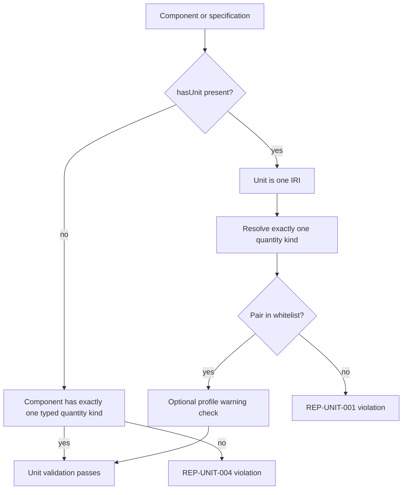
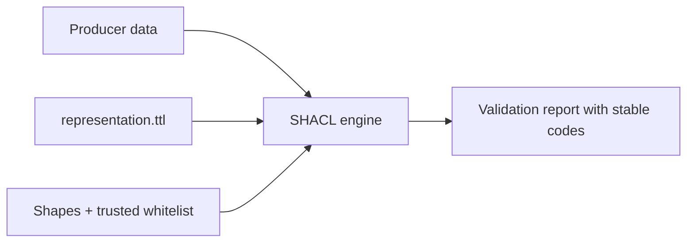

# Unit validation flow

For unit-bearing specifications, a missing or ambiguous kind also produces
`REP-UNIT-005`. A supplied unit outside the table means unsupported by the
current profile.

## Validation ownership

The whitelist is validation configuration. Producer data must not be allowed
to widen it.
