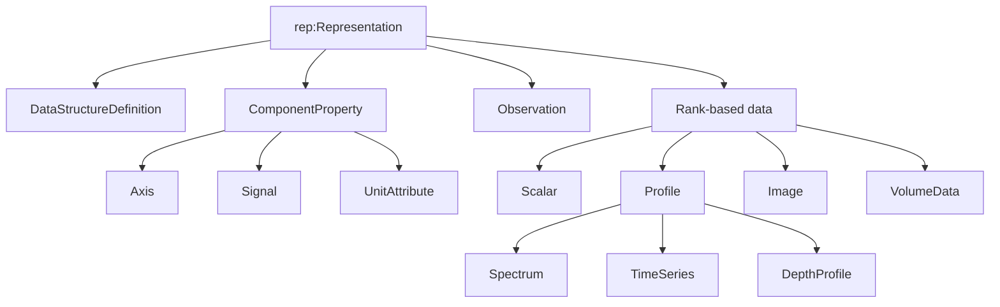
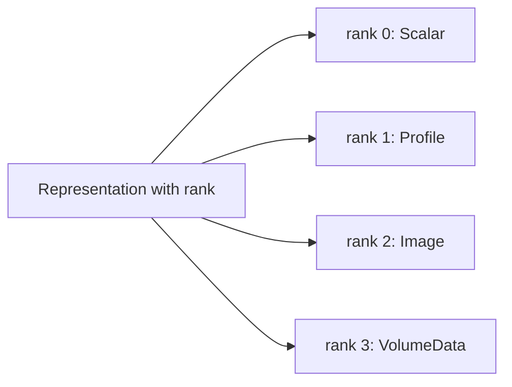
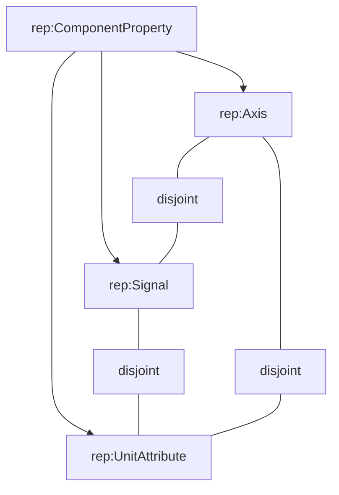
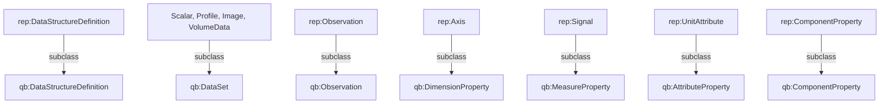
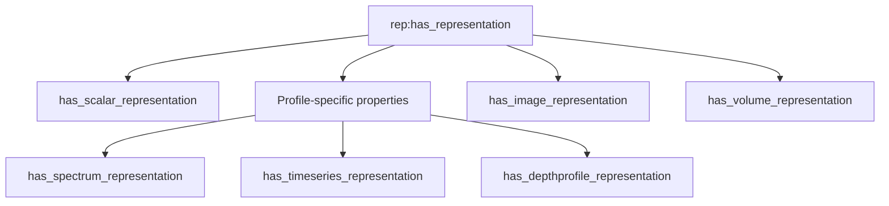
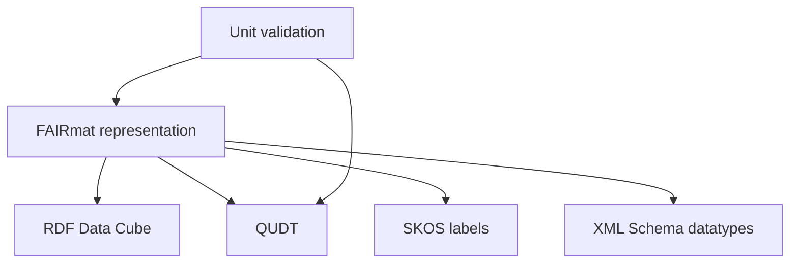

# Class hierarchy and RDF Data Cube bridges

This page separates the internal FAIRmat hierarchy from its external class
alignment. Solid arrows denote `rdfs:subClassOf`. The component partition is
an `owl:disjointUnionOf`.

## Internal representation hierarchy



The ontology does not declare a separate `RankBasedData` class; that diagram
node groups Scalar, Profile, Image, and VolumeData for readability.

## Rank-defined classes



Their OWL definitions are:

```text
Scalar     ≡ Representation ⊓ ∃rank.{0}
Profile    ≡ Representation ⊓ ∃rank.{1}
Image      ≡ Representation ⊓ ∃rank.{2}
VolumeData ≡ Representation ⊓ ∃rank.{3}
```

The direction from right to left matters. A node asserted as
`rep:Representation` with `rep:rank 2` can be classified as `rep:Image` by an
OWL reasoner.

Spectrum, TimeSeries, and DepthProfile remain primitive:

```text
Spectrum     ⊑ Profile
TimeSeries   ⊑ Profile
DepthProfile ⊑ Profile
```

The producer supplies the scientific subtype because rank one cannot
distinguish energy, time, and depth.

## Component partition



Formally:

```text
ComponentProperty ≡ Axis ⊔ Signal ⊔ UnitAttribute
Axis ⊓ Signal ≡ ⊥
Axis ⊓ UnitAttribute ≡ ⊥
Signal ⊓ UnitAttribute ≡ ⊥
```

For example, if `rep:energy` is used as a `qb:measure` and the loaded Data Cube
axioms make that usage a MeasureProperty, it conflicts with its Axis role.
Validation pipelines should still use explicit SHACL rules for predictable
closed-world error reporting.

## RDF Data Cube attachment points



These are logical subclass axioms. The earlier `skos:closeMatch` class
statements are absent. FAIRmat classes are intentionally narrower than the
generic Data Cube classes, so `owl:equivalentClass` would be too strong.

## What an RDFS reasoner derives

Asserted data:

```turtle
ex:map a rep:Image .
ex:pixel a rep:Observation .
ex:map-dsd a rep:DataStructureDefinition .
```

Derived types:

```turtle
ex:map a qb:DataSet .
ex:pixel a qb:Observation .
ex:map-dsd a qb:DataStructureDefinition .
```

The examples state only the FAIRmat types. Generic Data Cube queries therefore
need RDFS entailment or materialized superclass types.

## Property structure



The diagram groups the three profile properties for readability. In OWL, every
typed property is directly an `rdfs:subPropertyOf rep:has_representation`.

The current ontology keeps all representation properties functional:

```text
Functional(has_representation)
Functional(has_scalar_representation)
Functional(has_spectrum_representation)
Functional(has_timeseries_representation)
Functional(has_depthprofile_representation)
Functional(has_image_representation)
Functional(has_volume_representation)
```

This is a retained semantic decision. It should be reviewed separately if one
material-property instance must support several representation resources.

## Quantity-kind and unit ranges

```text
domain(hasQuantityKind) = rep:ComponentProperty
range(hasQuantityKind)  = qudt:QuantityKind
Functional(hasQuantityKind)

domain(hasUnit) = rep:ComponentProperty ⊔ qb:ComponentSpecification
range(hasUnit)  = qudt:Unit
Functional(hasUnit)
```

The canonical QUDT classes are:

```text
http://qudt.org/schema/qudt/QuantityKind
http://qudt.org/schema/qudt/Unit
```

Functional `rep:hasUnit` means at most one value. It does not require any unit
value. SHACL checks the explicit graph and rejects more than one supplied unit.

## External vocabulary map



| External vocabulary | Used for |
|---|---|
| RDF Data Cube | datasets, structures, specifications, dimensions, measures, observations |
| QUDT | canonical classes, quantity kinds, and units |
| SKOS | preferred labels only in the revised class alignment |
| XML Schema | rank, extent, and observation literal datatypes |
| SHACL | closed-world unit and quantity-kind checks |

## No ordering axiom

Neither `rep:order` nor a local `qb:order` declaration exists. The class and
property graphs above establish membership and meaning, not storage sequence.

