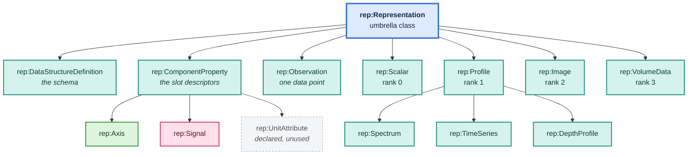
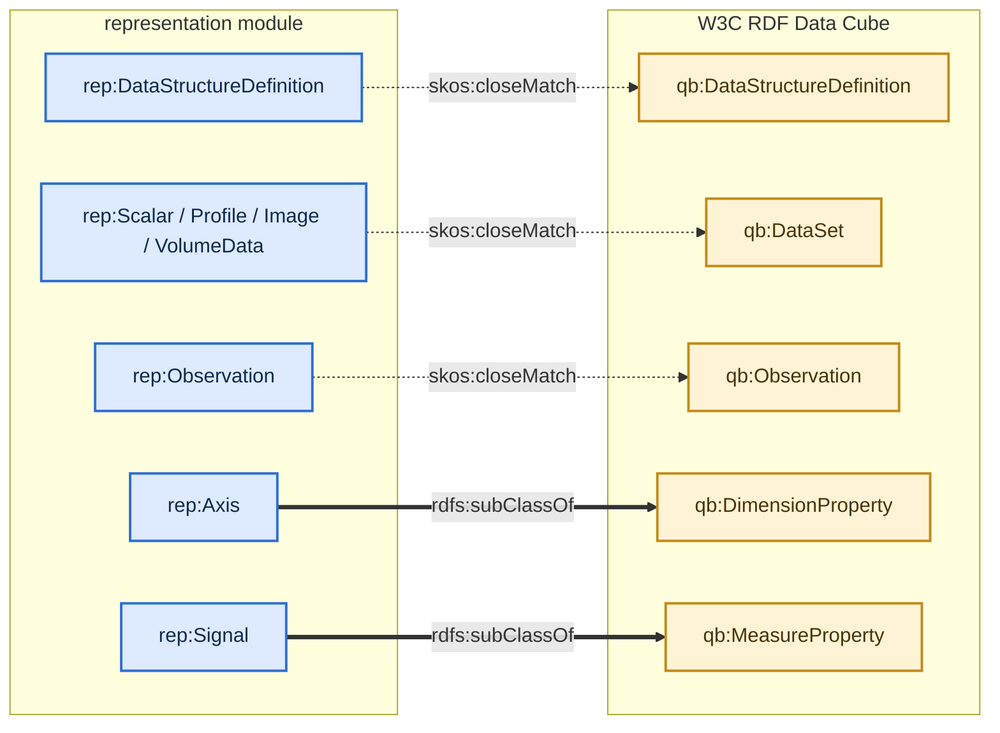
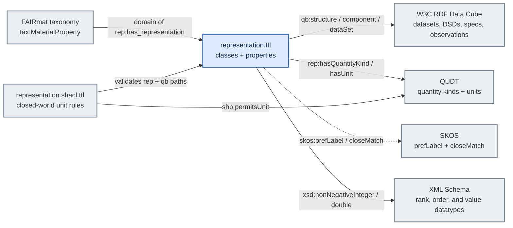

# Class hierarchy and the qb bridges

> Colour legend: purple = taxonomy, blue = dataset, teal = schema,
> amber = component specification, green = axis, pink = signal,
> grey = QUDT kind and unit. See [overview.md](overview.md).

Not a data walk — the TBox itself. Two things to see: everything
descends from `rep:Representation`, and five representation concepts
touch W3C RDF Data Cube.

---

## rep:Representation



`rep:ComponentProperty` is an `owl:disjointUnionOf (rep:Axis rep:Signal
rep:UnitAttribute)`. `rep:UnitAttribute` is drawn dashed because it is
declared but unused: this module attaches units directly rather than
through a qb attribute slot. It cannot simply be deleted — it is a
member of that disjoint union, and removing it would break the axiom.

That same axiom is why `rep:hasUnit` could not keep its original
`rdfs:domain rep:UnitAttribute`. A unit on `rep:energy` would have
entailed `rep:energy a rep:UnitAttribute`, colliding with `rep:Axis`.
Confirmed inconsistent under HermiT; see `CHANGELOG/representation.txt`.

---

## Where qb attaches



The two heavy edges are real subsumption: `rep:Axis` is a subclass of
`qb:DimensionProperty`, and `rep:Signal` is a subclass of
`qb:MeasureProperty`. Canonical component IRIs are then used in two
roles in the RDF graph: as **individuals** with metadata and as
**predicates** on observations:

```turtle
rep:energy a rep:Axis ; rep:hasQuantityKind qk:Energy ; rep:hasUnit unit:EV .

ex:obs a rep:Observation , qb:Observation ;
    qb:dataSet ex:xps_survey ;
    rep:energy "7980.0"^^xsd:double ;
    rep:intensity "12"^^xsd:nonNegativeInteger .
```

The dotted edges are alignment only — `skos:closeMatch`, deliberately
not `owl:equivalentClass`, so importing qb is not a hard dependency.

**On flat per-axis predicates.** Using one shared `rdf:value` predicate
with a positional index was tried and fails: duplicate magnitudes
(Y = Z = 29.0) collapse, because RDF triples are a set. Per-axis
predicates are not stylistic — they are required for correctness.

---

## Every external vocabulary in the implementation



OWL/RDFS supplies class definitions, domains, ranges, functionality,
subclass/subproperty links, and the disjoint union. SKOS supplies loose
alignment where the module intentionally avoids importing an external
class as a hard dependency. SHACL supplies constraints that OWL cannot
express under open-world semantics.
