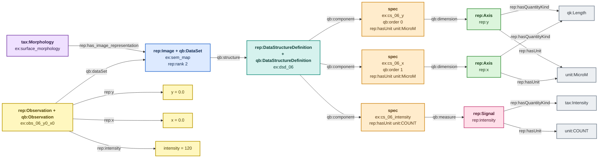

# Image — rank 2

> Colour legend: purple = taxonomy, blue = dataset, teal = schema,
> amber = component specification, green = axis, pink = signal,
> yellow = observation/value, grey = QUDT kind and unit. See
> [overview.md](overview.md).

Two axes, `rep:y` then `rep:x`, and one signal. Ordering is
slowest-first, matching NumPy C-order and the NeXus `<axis>_indices`
convention. A rank-2 dataset uses that pair and no other.

**Example data.** An SEM intensity map, 3x4 pixels.

| y \ x | 0.0 | 0.5 | 1.0 | 1.5 |
|---|---|---|---|---|
| **0.0** | 120 | 118 | 131 | 127 |
| **0.5** | 119 | 145 | 162 | 130 |
| **1.0** | 121 | 133 | 128 | 125 |

Axis values in µm, cell values in counts. `rep:extent` on the dataset
is 12; on `rep:y` it is 3 and on `rep:x` it is 4. The signal never
carries an extent — it is always the product of the axis extents.

---

## TBox plus one ABox observation

Both axes converge on one `qk:Length` node and one `unit:MicroM` node.
That is not a drawing shortcut — they really are the same two IRIs.
`qb:order` on the amber specs is the only thing distinguishing y from x
positionally.

---

## Unit rule

| layer | rule | code |
|---|---|---|
| 1 | `qk:Length` permits the unit | `REP-UNIT-001` |
| 2 | Image axes use `unit:MicroM` or `unit:NanoM` | `REP-UNIT-014` |

Files: `examples/image-valid-micrometre-abox.ttl`,
`examples/image-invalid-seconds-abox.ttl` — the latter puts a time unit
on `rep:x` while `rep:y` stays correct, and the report names only the
offending specification.
