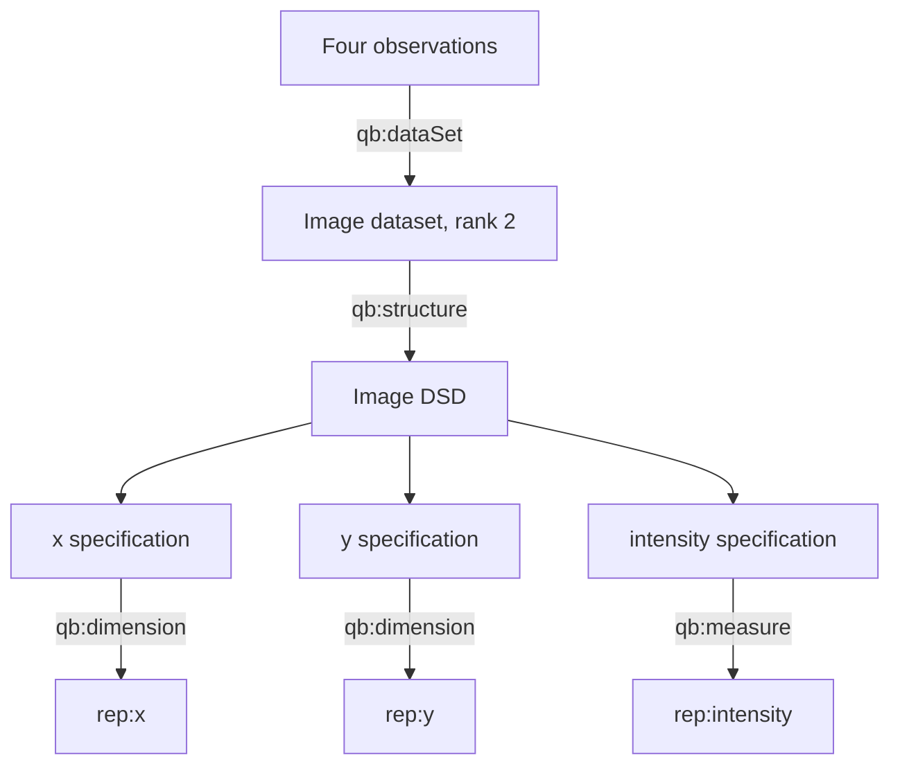
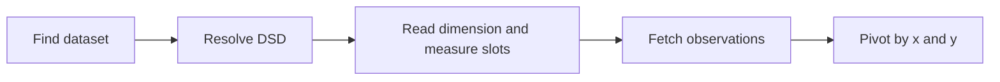

# Image representation

`rep:Image` represents a rank-two dataset. The bundled example is a 2 × 2 intensity image whose `x` and `y` coordinates are expressed in micrometres.

## Scientific view

| y (µm) \ x (µm) | 0.0 | 1.0 |
|---:|---:|---:|
| 0.0 | 125 | 140 |
| 1.0 | 119 | 153 |

The table is a presentation of four observations. RDF stores those observations as a graph; row-major or column-major storage is deliberately not asserted.

## Graph pattern



Both axes have `qk:Length`; the signal has `tax:Intensity`. The quantity kinds live on the reusable component predicates. Dataset-specific specifications select units and declare axis extents.

## Equivalent RDF pattern

```turtle
ex:image-valid-dataset a rep:Image ;
    rep:rank 2 ;
    rep:extent 4 ;
    qb:structure ex:image-valid-dsd .

ex:image-valid-dsd a rep:DataStructureDefinition ;
    qb:component ex:image-valid-axis-x,
                 ex:image-valid-axis-y,
                 ex:image-valid-signal .

ex:image-valid-axis-x a qb:ComponentSpecification ;
    qb:dimension rep:x ;
    rep:hasUnit unit:MicroM ;
    rep:extent 2 .

ex:image-valid-axis-y a qb:ComponentSpecification ;
    qb:dimension rep:y ;
    rep:hasUnit unit:MicroM ;
    rep:extent 2 .

ex:image-valid-signal a qb:ComponentSpecification ;
    qb:measure rep:intensity .

ex:image-valid-observation qb:dataSet ex:image-valid-dataset ;
    rep:x 0.0 ; rep:y 0.0 ; rep:intensity 125 .
ex:image-valid-observation-2 qb:dataSet ex:image-valid-dataset ;
    rep:x 1.0 ; rep:y 0.0 ; rep:intensity 140 .
ex:image-valid-observation-3 qb:dataSet ex:image-valid-dataset ;
    rep:x 0.0 ; rep:y 1.0 ; rep:intensity 119 .
ex:image-valid-observation-4 qb:dataSet ex:image-valid-dataset ;
    rep:x 1.0 ; rep:y 1.0 ; rep:intensity 153 .
```

## How a generic consumer reconstructs the table



The final pivot is application logic. The ontology provides the semantic roles, coordinate values, and measurement values; it does not prescribe a serialization layout.

```sparql
SELECT ?x ?y ?intensity
WHERE {
  ?observation qb:dataSet ex:image-valid-dataset ;
               rep:x ?x ;
               rep:y ?y ;
               rep:intensity ?intensity .
}
ORDER BY ?y ?x
```

## Inference and validation

- RDFS/OWL entails that the image is a `qb:DataSet` and a `rep:Representation`.
- `rep:x` and `rep:y` are discoverable as both Data Cube dimensions and representation components.
- `unit:MicroM` is allowed for `qk:Length`; `unit:NanoM` is also whitelisted and may be used if explicitly selected.
- An omitted unit is valid. If a unit is present, the whitelist is closed and strict.
- The current unit-only SHACL profile does not verify that rank is two, that both axes are present, that each extent is two, or that four coordinate pairs are complete and unique.
