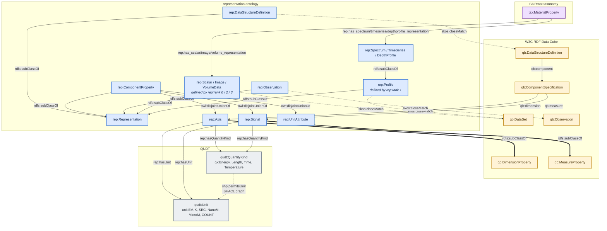
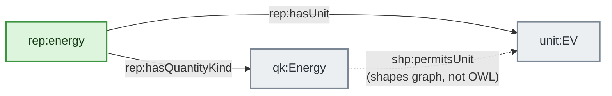
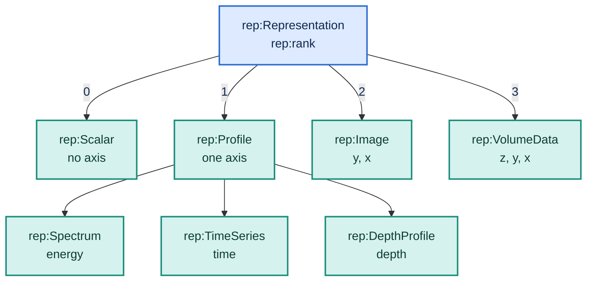

# Overview — the whole module in one picture

Read this page first. The five that follow it (`scalar.md`,
`profile.md`, `image.md`, `volume.md`, `class-hierarchy.md`) are the
same walk narrowed to one representation type.

Each implementation diagram combines the schema path with a real data
point:

> **material property** → `has_*_representation` → **dataset** →
> `qb:structure` → **DSD** → `qb:component` → **component spec** →
> `qb:dimension` / `qb:measure` → **canonical component** →
> `rep:hasQuantityKind` / `rep:hasUnit` → **kind + unit**, while a
> **`qb:Observation`** points back to the dataset and uses those same
> canonical components as predicates for literal values.

Colour is consistent across every page:

| colour | layer |
|---|---|
| purple | FAIRmat taxonomy (`tax:`) |
| blue | dataset — the `rep:Representation` subtype |
| teal | schema — the DSD |
| amber | component specification — where dataset-scoped facts live |
| green | canonical axis |
| pink | canonical signal |
| yellow | observation and literal value |
| grey | QUDT quantity kind and unit |

---

## Top-level ontology map

This is the TBox before any example instances are added. Solid arrows
are class or property axioms declared in `representation.ttl`; dotted
arrows are SKOS/SHACL relations. This keeps hard OWL subsumption
visually distinct from loose external alignment.



The three `skos:closeMatch` links do not entail class membership. For
that reason the examples explicitly type datasets as both a `rep:`
class and `qb:DataSet`, and observations as both `rep:Observation` and
`qb:Observation`. The axis and signal links are stronger
`rdfs:subClassOf` axioms.

---

## One concrete implementation, end to end

```mermaid
flowchart LR
    MP["tax:MeltingTemperature<br/><i>ex:melting_point</i>"]

    DS["rep:Scalar + qb:DataSet<br/><i>ex:tc_reading</i><br/>rep:rank 0"]

    DSD["rep:DataStructureDefinition<br/>+ qb:DataStructureDefinition<br/><i>ex:dsd_03</i>"]

    CS["qb:ComponentSpecification<br/><i>ex:cs_03_temperature</i><br/>rep:hasUnit unit:K"]

    SIG["rep:Signal<br/><b>rep:temperature</b>"]

    KIND["qk:Temperature"]
    UNIT["unit:K"]
    OBS["rep:Observation + qb:Observation<br/><i>ex:obs_03_000</i>"]
    VALUE["1811.0^^xsd:double"]

    MP -->|rep:has_scalar_representation| DS
    DS -->|qb:structure| DSD
    DSD -->|qb:component| CS
    CS -->|qb:measure| SIG
    SIG -->|rep:hasQuantityKind| KIND
    SIG -->|rep:hasUnit| UNIT
    OBS -->|qb:dataSet| DS
    OBS -->|rep:temperature| VALUE

    classDef tax  fill:#efe0ff,stroke:#7a3fa8,stroke-width:2px,color:#2d1b45
    classDef data fill:#ddeaff,stroke:#2f6fd0,stroke-width:2px,color:#10294f
    classDef dsd  fill:#d6f2ee,stroke:#1d8f7e,stroke-width:2px,color:#0d3d36
    classDef spec fill:#ffeccc,stroke:#d08a1d,stroke-width:2px,color:#4f3410
    classDef axis fill:#dcf5dc,stroke:#3d9440,stroke-width:2px,color:#173d18
    classDef sig  fill:#ffdfe9,stroke:#c9427a,stroke-width:2px,color:#4d162c
    classDef obs  fill:#fff7bf,stroke:#b89600,stroke-width:2px,color:#4b3e00
    classDef qudt fill:#eceff2,stroke:#7b8794,stroke-width:2px,color:#2b3138

    class MP tax
    class DS data
    class DSD dsd
    class CS spec
    class SIG sig
    class KIND,UNIT qudt
    class OBS,VALUE obs
```



---

## Why the layers are separate

**The dataset identifies the cube.** It holds a `rep:rank` and a
pointer to its schema. Each lifted `qb:Observation` points back to it
with `qb:dataSet` and carries the coordinates and signal values.

**The DSD is shared.** Ten XPS spectra with the same structure point at
one DSD. That is the whole reason the schema layer exists.

**The component specification is per-dataset.** `qb:order`,
`rep:extent` and `rep:hasUnit` live here, because the canonical
component is a shared singleton and must not carry facts about one
dataset.

**The canonical component is global.** `rep:energy` is the same IRI in
every spectrum in the knowledge graph. That is what makes

```sparql
SELECT ?e ?i WHERE { ?obs rep:energy ?e ; rep:intensity ?i }
```

work across the whole store rather than per-dataset. It carries the
module-default kind and unit.

---

## The two-edge unit model

Units hang directly off the component, in parallel with the kind — not
chained behind it.



The solid edges are OWL, in `representation.ttl`. The dotted edge is
SHACL, in `representation.shacl.ttl`, and is the constraint that the
two solid edges agree.

A `kind → unit` edge in OWL was evaluated and rejected: `rep:hasUnit`
is functional, so a second unit for the same kind turns into an
inconsistency rather than a second option. The inverse direction is
non-functional and answers silently wrong. Two independent edges off
the component keep both facts local and let SHACL do the agreeing.

---

## Rank determines type



`rep:Scalar`, `rep:Profile`, `rep:Image` and `rep:VolumeData` are
**defined** classes — `owl:equivalentClass` on the `rep:rank` value, so
a reasoner derives them. The three Profile subtypes are **primitive**:
rank 1 alone cannot tell a spectrum from a time series, so the producer
asserts which it is, and the axis IRI follows from that.
