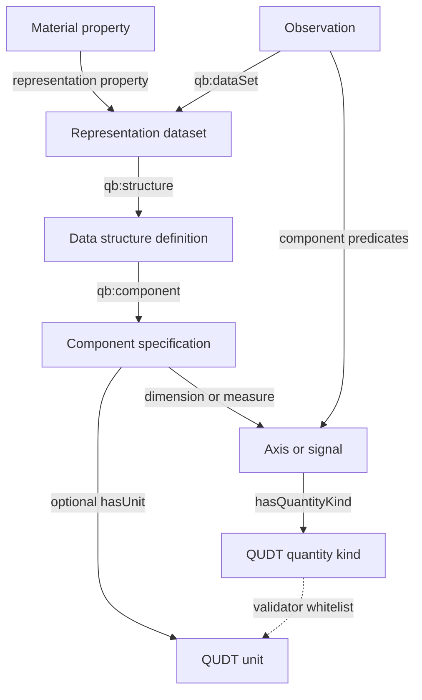
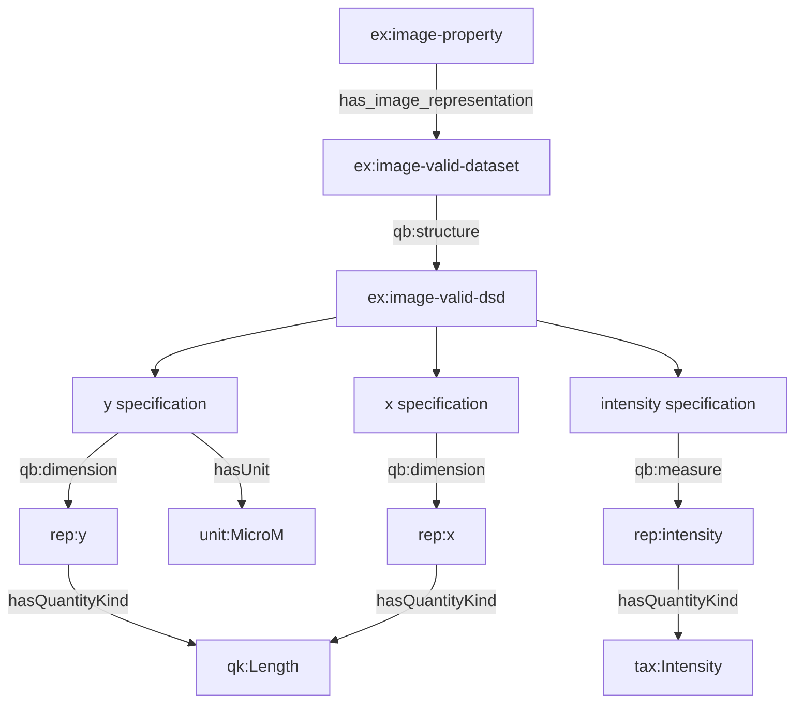
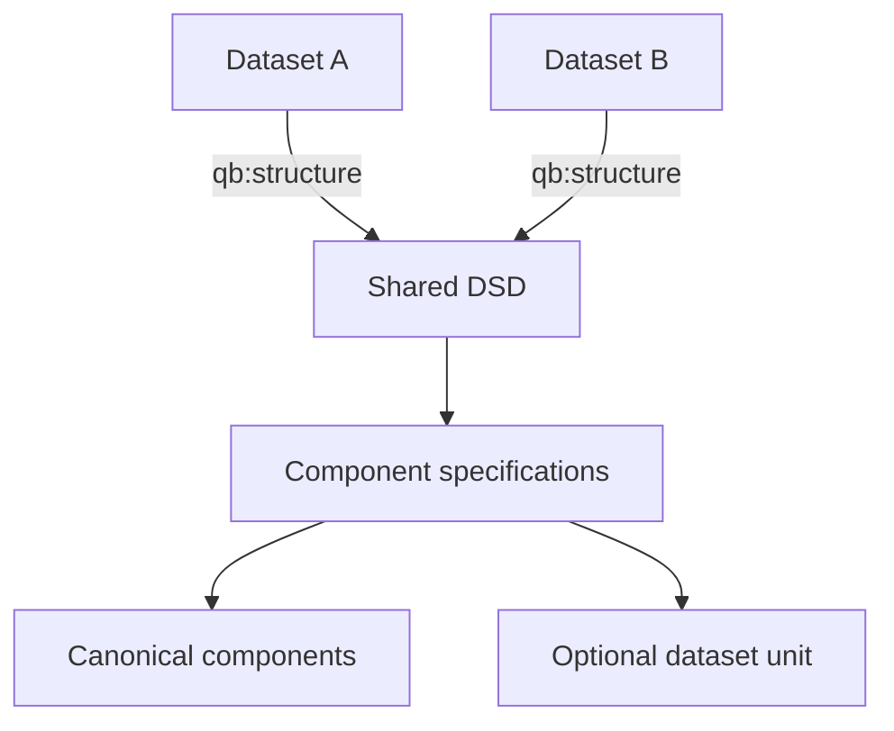
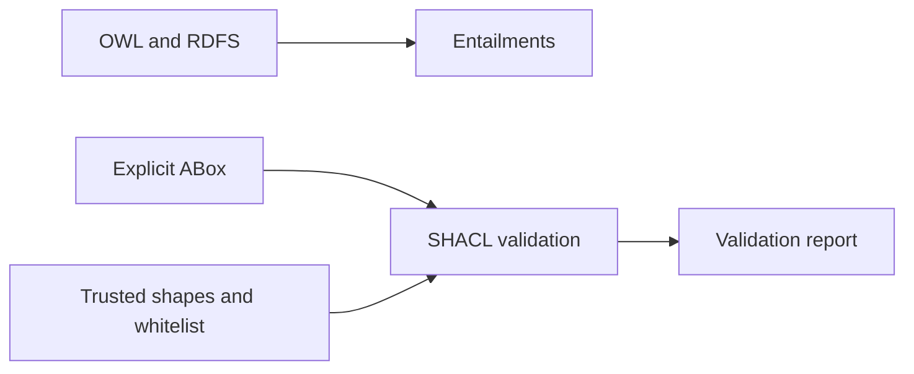
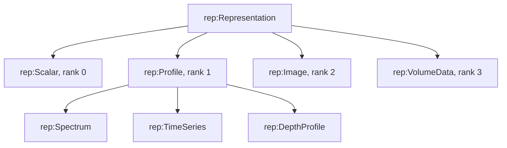
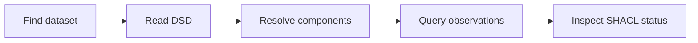

# Overview — the complete module

This page explains the ontology from the material property to concrete values.
It also shows which statements belong to OWL, RDF Data Cube, QUDT, and SHACL.

## Top-level architecture



The dataset states rank and links to one structure. The DSD lists
dataset-specific specification nodes. A specification selects a reusable
component and may state a unit. An observation uses the component IRI as a
predicate whose object is the measured value.

## Vocabulary ownership

| Namespace | Responsibility in this module |
|---|---|
| `tax:` | material-property domain and local uncalibrated Intensity kind |
| `rep:` | representation classes, components, rank, extent, and links |
| `qb:` | dataset, DSD, component-specification, and observation pattern |
| `qudt:` | canonical QuantityKind and Unit classes |
| `qk:` | quantity-kind individuals |
| `unit:` | unit individuals |
| `shp:` | validator-owned whitelist and stable result metadata |
| `sh:` | SHACL shapes, targets, paths, severities, and reports |

The QUDT schema prefix is `http://qudt.org/schema/qudt/`. FAIRmat classes use
`rdfs:subClassOf` to specialize RDF Data Cube classes.

## One complete Image path



Only the y specification supplies a unit. The x and intensity specifications
remain valid because `rep:hasUnit` is optional.

A pixel is a separate node:

```turtle
ex:image-valid-observation-y1-x1 a rep:Observation ;
    qb:dataSet ex:image-valid-dataset ;
    rep:y "1"^^xsd:nonNegativeInteger ;
    rep:x "1"^^xsd:nonNegativeInteger ;
    rep:intensity "153"^^xsd:nonNegativeInteger .
```

The observation can be queried without traversing a positional list. The DSD
tells a generic client which predicates constitute the coordinates and
measures.

## Schema reuse and dataset-specific metadata



The model allows a DSD to be reused. In the supplied examples, each fixture
uses its own named DSD so validation cases remain independent.

The component carries its stable meaning:

```turtle
rep:energy a owl:NamedIndividual, owl:DatatypeProperty, rep:Axis ;
    rdfs:range rdfs:Literal ;
    rep:hasQuantityKind qk:Energy ;
    rep:hasUnit unit:EV .
```

A specification carries dataset context:

```turtle
ex:spectrum-valid-axis-energy a qb:ComponentSpecification ;
    qb:dimension rep:energy ;
    rep:hasUnit unit:EV .
```

The canonical unit assertion is retained ontology metadata. The model defines
no algorithm that copies it to a specification or treats it as a fallback.

## OWL and SHACL responsibilities



OWL/RDFS handles:

- class and subproperty relationships;
- rank-based class definitions;
- domains, ranges, and functional properties;
- the disjoint union of Axis, Signal, and UnitAttribute;
- Data Cube superclass inference.

SHACL handles:

- required quantity-kind metadata;
- optional-unit explicit cardinality;
- unit IRI checks;
- whitelist membership when a unit is present;
- advisory representation profiles;
- stable error codes and remedies.

## Rank and scientific specialization



The four rank classes are defined classes. The three profile types are
primitive scientific specializations asserted by the producer.

## Query path

A generic consumer can discover and read values in four steps:



The ontology provides no component ordering. Consumers query membership and
apply a separately agreed serialization rule when they need array order.

## Continue reading

- [class-hierarchy.md](class-hierarchy.md) gives every class bridge and key
  property axiom.
- [scalar.md](scalar.md) explains the rank-zero case.
- [profile.md](profile.md) compares Spectrum, TimeSeries, and DepthProfile.
- [image.md](image.md) walks through the 2 × 2 image.
- [volume.md](volume.md) walks through the 2 × 2 × 2 volume.
- [validation.md](validation.md) maps each SHACL code to the graph path it
  checks.

