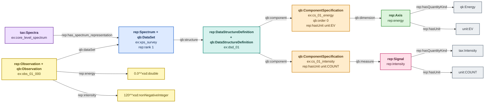
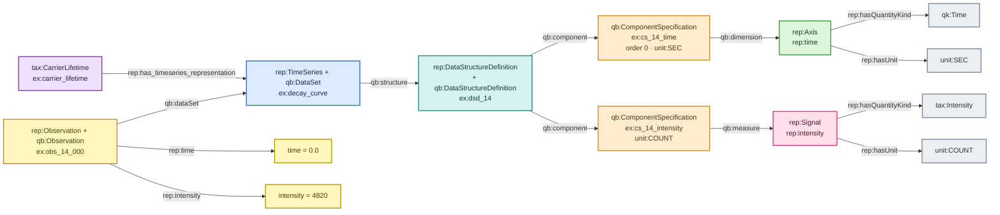
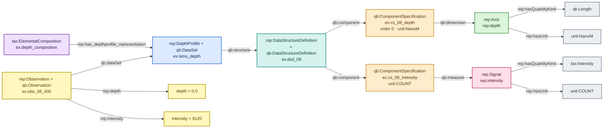

# Profile — rank 1

> Colour legend: purple = taxonomy, blue = dataset, teal = schema,
> amber = component specification, green = axis, pink = signal,
> yellow = observation/value, grey = QUDT kind and unit. See
> [overview.md](overview.md).

One axis, one signal. Three named subtypes share the rank and differ
only in which canonical axis they use:

| subtype | axis | canonical unit | quantity kind |
|---|---|---|---|
| `rep:Spectrum` | `rep:energy` | `unit:EV` | `qk:Energy` |
| `rep:TimeSeries` | `rep:time` | `unit:SEC` | `qk:Time` |
| `rep:DepthProfile` | `rep:depth` | `unit:NanoM` | `qk:Length` |

`rep:Profile` itself is a **defined** class — rank 1. The three
subtypes are **primitive**: rank alone cannot distinguish them, so the
producer asserts which one it is.

---

## Spectrum

**Example data.** An XPS survey scan.

| energy (eV) | intensity (count) |
|---|---|
| 0.0 | 120 |
| 0.5 | 134 |
| 1.0 | 129 |
| … | … |

---

## TimeSeries

## DepthProfile

The two implementations have the same RDF Data Cube topology; only
the green canonical axis and its QUDT kind/unit change. Both datasets
state their unit on their own component specification;
`SPARQL_USAGE.md` Q7 surfaces deviations from the module default.

---

## Unit rules

| subtype | permitted at Layer 2 | code |
|---|---|---|
| Spectrum axis | `unit:EV` | `REP-UNIT-011` |
| TimeSeries axis | `unit:SEC` | `REP-UNIT-012` |
| DepthProfile axis | `unit:NanoM` | `REP-UNIT-013` |
| any intensity signal | `unit:COUNT` | `REP-UNIT-016` |

**Why Layer 2 exists, in one line:** `qk:Length` covers both the
nanometre-scale depth axis and the micrometre-scale image axes, so the
quantity kind alone cannot separate them — only the representation type
can. `examples/profile-depth-warn-micrometre-abox.ttl` is a depth axis in
micrometres: a permitted length unit, exactly right on an image axis,
three orders of magnitude off here. Warning, not violation.
