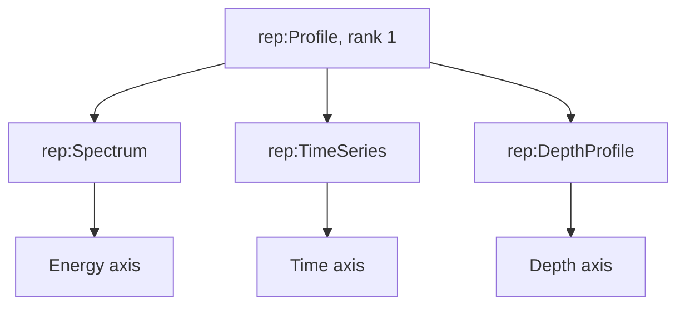
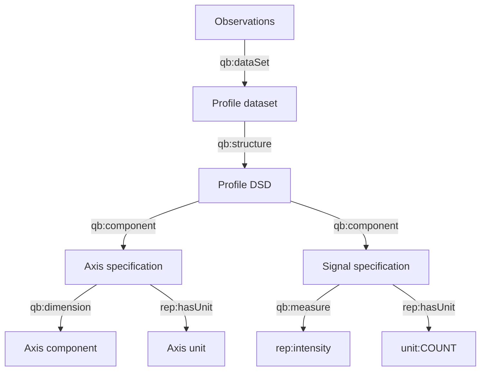

# One-dimensional profiles

`rep:Spectrum`, `rep:TimeSeries`, and `rep:DepthProfile` are specializations of `rep:Profile`. All have rank one, but the coordinate carries a different scientific quantity kind.

## Shared pattern and scientific distinction

| Representation | Coordinate predicate | Coordinate kind | Profile unit | Signal | Signal kind | Signal unit |
|---|---|---|---|---|---|---|
| Spectrum | `rep:energy` | `qk:Energy` | `unit:EV` | `rep:intensity` | `tax:Intensity` | `unit:COUNT` |
| Time series | `rep:time` | `qk:Time` | `unit:SEC` | `rep:intensity` | `tax:Intensity` | `unit:COUNT` |
| Depth profile | `rep:depth` | `qk:Length` | `unit:NanoM` | `rep:intensity` | `tax:Intensity` | `unit:COUNT` |

The common profile shape supports generic processing while the component quantity kind preserves the scientific meaning of the coordinate.



## Dataset structure

Every profile uses two component specifications: one dimension slot and one measure slot.



No ordering predicate is defined. The coordinate values themselves provide the scientific index. Consumers may sort numeric coordinate values for presentation, but that is an application operation rather than an ontology assertion about storage order.

## Worked data

### Spectrum

| Energy (eV) | Intensity (count) |
|---:|---:|
| 10.0 | 125 |
| 10.5 | 142 |
| 11.0 | 131 |

```turtle
ex:spectrum-dataset a rep:Spectrum ;
    rep:rank 1 ; rep:extent 3 ; qb:structure ex:spectrum-dsd .

ex:spectrum-energy-slot qb:dimension rep:energy ;
    rep:hasUnit unit:EV ; rep:extent 3 .
ex:spectrum-intensity-slot qb:measure rep:intensity ;
    rep:hasUnit unit:COUNT .

ex:spectrum-observation-1 qb:dataSet ex:spectrum-dataset ;
    rep:energy 10.0 ; rep:intensity 125 .
```

### Time series

| Time (s) | Intensity (count) |
|---:|---:|
| 0.5 | 125 |
| 1.0 | 101 |
| 1.5 | 82 |

```turtle
ex:timeseries-dataset a rep:TimeSeries ;
    rep:rank 1 ; rep:extent 3 ; qb:structure ex:timeseries-dsd .

ex:timeseries-time-slot qb:dimension rep:time ;
    rep:hasUnit unit:SEC ; rep:extent 3 .
ex:timeseries-intensity-slot qb:measure rep:intensity ;
    rep:hasUnit unit:COUNT .

ex:timeseries-observation-1 qb:dataSet ex:timeseries-dataset ;
    rep:time 0.5 ; rep:intensity 125 .
```

### Depth profile

| Depth (nm) | Intensity (count) |
|---:|---:|
| 25.0 | 125 |
| 27.5 | 112 |
| 30.0 | 97 |

```turtle
ex:depthprofile-dataset a rep:DepthProfile ;
    rep:rank 1 ; rep:extent 3 ; qb:structure ex:depthprofile-dsd .

ex:depthprofile-depth-slot qb:dimension rep:depth ;
    rep:hasUnit unit:NanoM ; rep:extent 3 .
ex:depthprofile-intensity-slot qb:measure rep:intensity ;
    rep:hasUnit unit:COUNT .

ex:depthprofile-observation-1 qb:dataSet ex:depthprofile-dataset ;
    rep:depth 25.0 ; rep:intensity 125 .
```

The abbreviated fragments assume the prefixes declared in the fixture files. Complete executable versions are in `../examples/`.

## Querying all profiles uniformly

```sparql
SELECT ?dataset ?profileType ?coordinate ?signal
WHERE {
  VALUES (?profileType ?axis) {
    (rep:Spectrum     rep:energy)
    (rep:TimeSeries   rep:time)
    (rep:DepthProfile rep:depth)
  }
  ?dataset a ?profileType .
  ?observation qb:dataSet ?dataset ;
               ?axis ?coordinate ;
               rep:intensity ?signal .
}
ORDER BY ?dataset ?coordinate
```

For generic class discovery, RDFS entailment makes every specialized dataset a `rep:Profile` and a `qb:DataSet`. Without entailment, use a property path such as `a/rdfs:subClassOf* rep:Profile` or query the explicit concrete types.

## Validation boundary

The required layer checks quantity-kind resolution and whitelist membership. It does not check that a Spectrum specifically uses `rep:energy`, that extents equal observation counts, or that coordinates are monotonic. The per-type shapes emit warnings for the expected profile units; they remain advisory and require SHACL Advanced Features.

