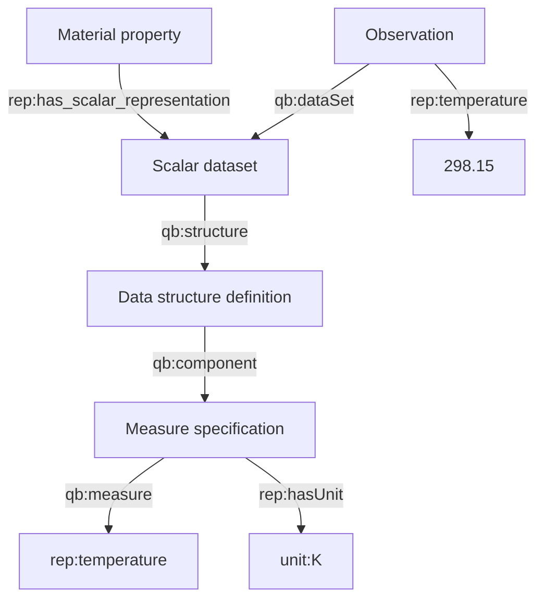
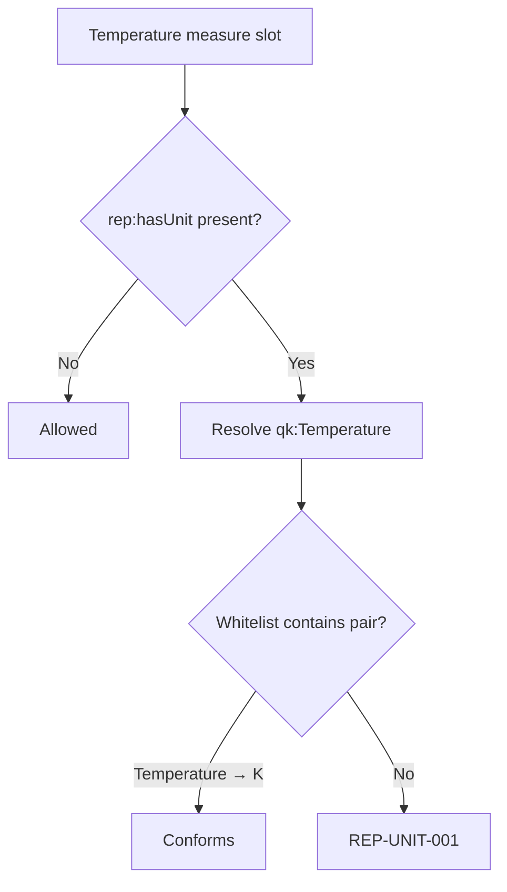

# Scalar representation

`rep:Scalar` models a rank-zero material-property result: one dataset, no coordinate axis, and one or more measured values. The bundled fixture represents a temperature of 298.15 K.

## Scientific view

| Dataset | Rank | Observation | Signal | Value | Unit |
|---|---:|---|---|---:|---|
| `ex:scalar-valid-dataset` | 0 | `ex:scalar-valid-observation` | `rep:temperature` | 298.15 | omitted |

Rank zero means that the value is not indexed by a coordinate. It does **not** mean that the dataset has no structure: its Data Structure Definition still identifies the signal slot and the slot may state an optional unit.

## TBox and ABox together



The ontology supplies three reusable semantics here:

- `rep:Scalar rdfs:subClassOf qb:DataSet`, so RDFS-aware Data Cube tools can discover the dataset generically.
- `rep:temperature` is both an `owl:DatatypeProperty` and a `rep:Signal`; it carries `rep:hasQuantityKind qk:Temperature`.
- `rep:has_scalar_representation rdfs:subPropertyOf rep:has_representation`, so a reasoner can expose both the specific and generic material-property link.

## Equivalent RDF pattern

```turtle
@prefix ex:   <http://example.org/representation/> .
@prefix rep:  <http://fairmat-nfdi.eu/taxonomy/representation#> .
@prefix tax:  <http://fairmat-nfdi.eu/taxonomy/> .
@prefix qb:   <http://purl.org/linked-data/cube#> .
@prefix unit: <http://qudt.org/vocab/unit/> .
@prefix xsd:  <http://www.w3.org/2001/XMLSchema#> .

ex:scalar-property a tax:MaterialProperty ;
    rep:has_scalar_representation ex:scalar-valid-dataset .

ex:scalar-valid-dataset a rep:Scalar ;
    rep:rank "0"^^xsd:nonNegativeInteger ;
    rep:extent "1"^^xsd:nonNegativeInteger ;
    qb:structure ex:scalar-valid-dsd .

ex:scalar-valid-dsd a rep:DataStructureDefinition ;
    qb:component ex:scalar-valid-signal .

ex:scalar-valid-signal a qb:ComponentSpecification ;
    qb:measure rep:temperature .

ex:scalar-valid-observation a rep:Observation ;
    qb:dataSet ex:scalar-valid-dataset ;
    rep:temperature 298.15 .
```

The unit is metadata on the component specification, not on the numeric literal. This makes every observation in the dataset share the same declared unit without repeating it.

## What OWL can infer

With RDFS/OWL entailment enabled:

| Asserted statement | Entailed statement |
|---|---|
| `ex:scalar-valid-dataset a rep:Scalar` | `ex:scalar-valid-dataset a qb:DataSet` |
| `ex:scalar-observation a rep:Observation` | `ex:scalar-observation a qb:Observation` |
| `ex:scalar-property rep:has_scalar_representation ex:scalar-valid-dataset` | `ex:scalar-property rep:has_representation ex:scalar-valid-dataset` |
| `ex:scalar-valid-dataset rep:rank 0` plus `a rep:Representation` | membership in `rep:Scalar` through its equivalent-class axiom |

OWL does not manufacture the DSD, observation, extent, numeric value, or unit. Those facts must be asserted by the producer.

## Optional unit and validation outcomes



- Omitting `rep:hasUnit` is valid.
- Supplying `unit:K` conforms to the required whitelist layer.
- Supplying `unit:EV` fails because the profile does not permit `(qk:Temperature, unit:EV)`.
- Supplying a unit while the referenced component lacks a quantity kind fails with `REP-UNIT-004` and/or `REP-UNIT-005`.

Whitelist rejection means “unsupported by this application profile,” not a general scientific proof that conversion or compatibility is impossible.
