# Scalar — rank 0

> Colour legend: purple = taxonomy, blue = dataset, teal = schema,
> amber = component specification, green = axis, pink = signal,
> yellow = observation/value, grey = QUDT kind and unit. See
> [overview.md](overview.md).

A single measured number. No axis at all: there is nothing to scan
over. The rank-0 case is the one people most often model badly, by
inventing a length-1 axis to make it look like the others. This module
does not — a Scalar has one component specification, and it is a
measure.

**Example data.** A thermocouple reading taken during a melting-point
determination.

| temperature |
|---|
| 1811.0 |

One cell. That is the entire dataset.

---

## TBox plus one ABox observation

```mermaid
flowchart LR
    MP["<b>tax:MeltingTemperature</b><br/>ex:melting_point"]
    DS["<b>rep:Scalar + qb:DataSet</b><br/>ex:tc_reading<br/>rep:rank 0"]
    DSD["<b>rep:DataStructureDefinition<br/>+ qb:DataStructureDefinition</b><br/>ex:dsd_03"]
    CS["<b>qb:ComponentSpecification</b><br/>ex:cs_03_temperature<br/>rep:hasUnit unit:K"]
    SIG["<b>rep:Signal</b><br/>rep:temperature"]
    K["qk:Temperature"]
    U["unit:K"]
    OBS["<b>rep:Observation + qb:Observation</b><br/>ex:obs_03_000"]
    VAL["1811.0^^xsd:double"]

    MP -->|rep:has_scalar_representation| DS
    DS -->|qb:structure| DSD
    DSD -->|qb:component| CS
    CS -->|qb:measure| SIG
    SIG -->|rep:hasQuantityKind| K
    SIG -->|rep:hasUnit| U
    OBS -->|qb:dataSet| DS
    OBS -->|rep:temperature| VAL

    classDef tax  fill:#efe0ff,stroke:#7a3fa8,stroke-width:2px,color:#2d1b45
    classDef data fill:#ddeaff,stroke:#2f6fd0,stroke-width:2px,color:#10294f
    classDef dsd  fill:#d6f2ee,stroke:#1d8f7e,stroke-width:2px,color:#0d3d36
    classDef spec fill:#ffeccc,stroke:#d08a1d,stroke-width:2px,color:#4f3410
    classDef axis fill:#dcf5dc,stroke:#3d9440,stroke-width:2px,color:#173d18
    classDef sig  fill:#ffdfe9,stroke:#c9427a,stroke-width:2px,color:#4d162c
    classDef obs  fill:#fff7bf,stroke:#b89600,stroke-width:2px,color:#4b3e00
    classDef qudt fill:#eceff2,stroke:#7b8794,stroke-width:2px,color:#2b3138
    class MP tax
    class DS data
    class DSD dsd
    class CS spec
    class SIG sig
    class K,U qudt
    class OBS,VAL obs
```

**No green axis node appears.** That absence is the whole character of
rank 0. The yellow branch is the actual data row: `rep:temperature` is
both the signal individual described by the TBox and the predicate on
the observation.

---

## Unit rule

| layer | rule | code |
|---|---|---|
| 1 | `qk:Temperature` permits `unit:K` | `REP-UNIT-001` |
| 2 | a Scalar temperature signal is reported in `unit:K` | `REP-UNIT-010` |

Files: `examples/scalar-valid-kelvin-abox.ttl`,
`examples/scalar-invalid-metre-abox.ttl`.
