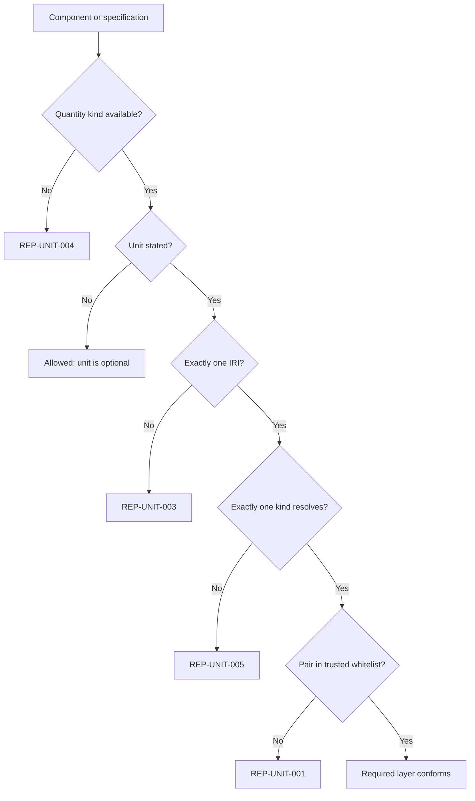
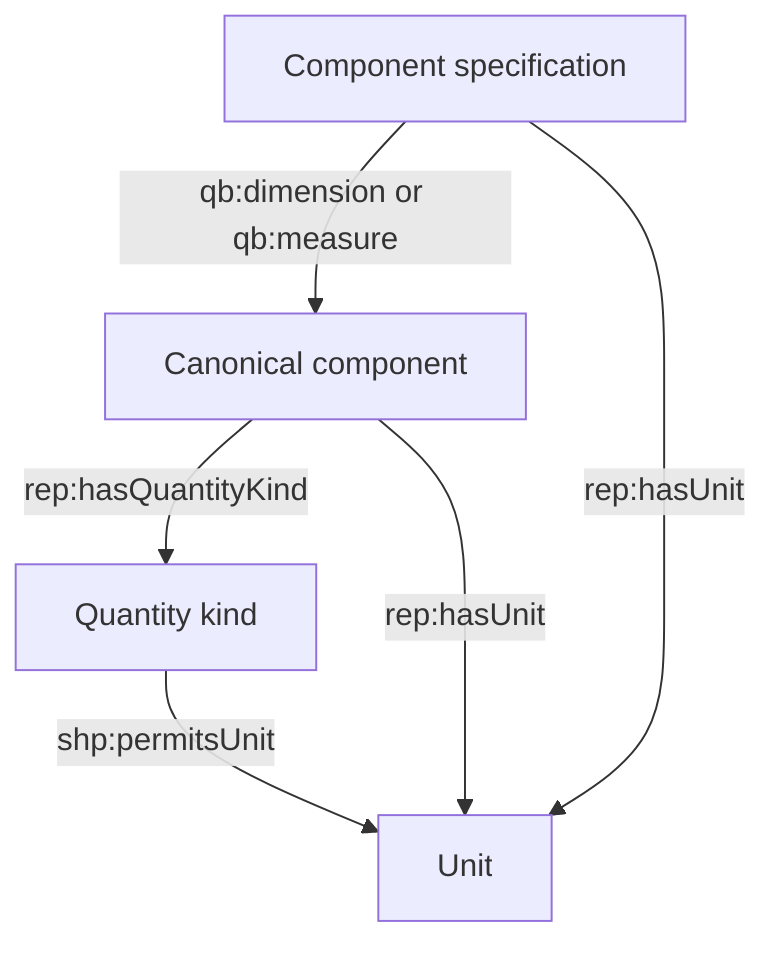
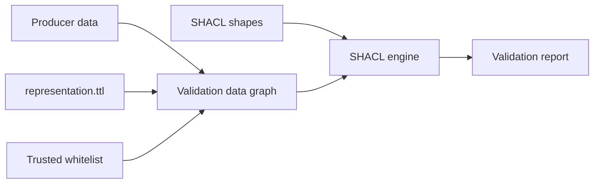

# Unit validation architecture

The companion SHACL graph is intentionally a **unit-only application profile**. It validates units that producers choose to state and guarantees that their scientific context is identifiable. It does not attempt full Data Cube integrity, array completeness, rank consistency, or unit conversion.

## Decision path



Quantity-kind metadata is required for components even if their units are omitted. This closes the former bypass where a producer could attach a unit but leave the validator unable to decide compatibility.

## Two placements, one rule



For a canonical component, the kind is resolved directly. For a dataset-specific component specification, the validator follows `qb:dimension`, `qb:measure`, or `qb:attribute` to the referenced component and reads its kind. Both routes join against the same validator-owned table.

## Required error codes

| Code | Severity | Condition | Producer action |
|---|---|---|---|
| `REP-UNIT-001` | Violation | Resolved kind/unit pair is absent from the whitelist | Choose an allowed unit, correct the kind, or omit the unit |
| `REP-UNIT-002` | Violation | `rep:hasUnit` points to a `qudt:QuantityKind` | Point to a `qudt:Unit` individual |
| `REP-UNIT-003` | Violation | More than one unit, a literal unit, or another non-IRI value | State zero or one IRI-valued unit |
| `REP-UNIT-004` | Violation | A component lacks exactly one typed quantity kind | Add one `rep:hasQuantityKind` IRI typed as `qudt:QuantityKind` |
| `REP-UNIT-005` | Violation | A supplied unit has no unique resolvable kind context | Repair the direct or referenced component metadata |

Per-representation codes `REP-UNIT-010` through `REP-UNIT-015` are warnings. They express preferred reporting profiles such as energy in eV and time in seconds; they do not replace the required whitelist rules.

## Trusted whitelist

| Quantity kind | Permitted unit IRIs |
|---|---|
| `qk:Temperature` | `unit:K` |
| `qk:Length` | `unit:NanoM`, `unit:MicroM` |
| `qk:Time` | `unit:SEC` |
| `qk:Energy` | `unit:EV` |
| `tax:Intensity` | `unit:COUNT` |

The table is configuration owned by the validator. Producer-authored `shp:permitsUnit` statements must not be accepted as authority because they could make any submitted pair appear permitted.

Whitelist rejection has a narrow meaning: the pair is unsupported by this FAIRmat profile. It must not be presented as proof of dimensional or scientific incompatibility. A future policy may add more units or integrate conversion-aware QUDT services.

## Invalid example and expected report

```turtle
ex:spectrum-energy-slot
    qb:dimension rep:energy ;
    rep:hasUnit unit:SEC .
```

`rep:energy` resolves to `qk:Energy`, but the whitelist contains only `(qk:Energy, unit:EV)`. A SHACL report therefore identifies the slot as the focus node, `unit:SEC` as the offending value, and `shp:UnitKindAgreementShape` as the source shape.

```text
focus node:   ex:spectrum-energy-slot
value:        unit:SEC
source shape: shp:UnitKindAgreementShape
code:         REP-UNIT-001
severity:     sh:Violation
```

The code is metadata on the source shape. Report consumers can resolve `sh:sourceShape` back to `shp:code`, `shp:category`, and `shp:remedy` for stable user-facing diagnostics.

## Validation deployment



Recommended processing:

1. Parse `representation.ttl`, the producer graph, and the trusted whitelist into the validation data graph.
2. Use `representation.shacl.ttl` as the shapes graph.
3. Run before OWL identity materialization, because `owl:FunctionalProperty` reasoning can equate multiple values instead of reporting the authoring error.
4. Enable SHACL-SPARQL and SHACL Advanced Features for the advisory SPARQL targets.
5. Treat `sh:Violation` as blocking. Use `allow_warnings=True` when advisory profile deviations should not fail ingestion.

## Scope boundary

| Checked now | Deliberately outside this profile |
|---|---|
| Optional unit cardinality | Rank versus number of dimensions |
| Unit IRI typing | Dataset extent arithmetic |
| Quantity-kind presence and uniqueness | Observation completeness and uniqueness |
| Closed whitelist membership | Coordinate monotonicity or ordering |
| Advisory representation-specific units | Unit conversion and numerical normalization |

This division keeps validation predictable and inexpensive while the broader representation semantics continue to evolve.
