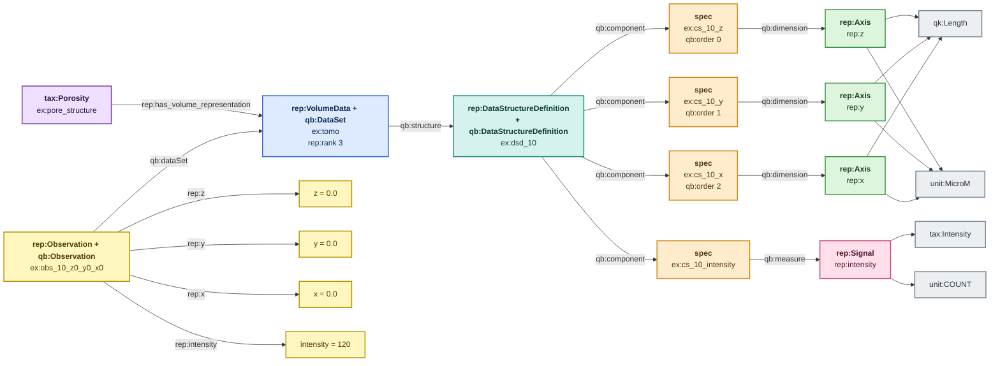

# VolumeData — rank 3

> Colour legend: purple = taxonomy, blue = dataset, teal = schema,
> amber = component specification, green = axis, pink = signal,
> yellow = observation/value, grey = QUDT kind and unit. See
> [overview.md](overview.md).

Three axes, `rep:z` then `rep:y` then `rep:x`, and one signal. Same
pattern as Image with one more dimension; slowest-first ordering again.

**Example data.** A tomography reconstruction, 2 slices of 2x3.

| z | y \ x | 0.0 | 0.5 | 1.0 |
|---|---|---|---|---|
| **0.0** | **0.0** | 120 | 118 | 131 |
| **0.0** | **0.5** | 119 | 145 | 162 |
| **1.0** | **0.0** | 122 | 117 | 129 |
| **1.0** | **0.5** | 118 | 140 | 158 |

Axis values in µm, cell values in counts. `rep:extent` on the dataset
is 12 — the product 2 x 2 x 3.

**Naming note.** The class is `rep:VolumeData`, not `rep:Volume`, and
carries `owl:disjointWith tax:Volume`. `tax:Volume` already exists in
the base taxonomy as a structural property — the amount of space a
material occupies. A 3D data cube is a different thing entirely, and
the collision is worth avoiding explicitly rather than by convention.

---

## TBox plus one ABox observation

The unlabelled edges into the grey nodes are `rep:hasQuantityKind` and
`rep:hasUnit`; labels are dropped here only to keep the diagram
readable at three axes.

---

## Unit rule

| layer | rule | code |
|---|---|---|
| 1 | `qk:Length` permits the unit | `REP-UNIT-001` |
| 2 | VolumeData axes use `unit:MicroM` or `unit:NanoM` | `REP-UNIT-015` |

File: `examples/volume-valid-micrometre-abox.ttl`.
