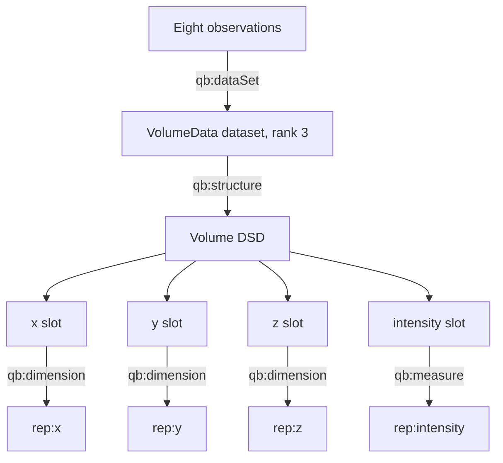

# Volume representation

`rep:VolumeData` represents a rank-three dataset. The bundled fixture is a 2 × 2 × 2 intensity volume using `x`, `y`, and `z` length coordinates.

## Scientific view

| z (µm) | y (µm) | x (µm) | Intensity (count) |
|---:|---:|---:|---:|
| 0.0 | 0.0 | 0.0 | 125 |
| 0.0 | 0.0 | 1.0 | 132 |
| 0.0 | 1.0 | 0.0 | 118 |
| 0.0 | 1.0 | 1.0 | 147 |
| 1.0 | 0.0 | 0.0 | 121 |
| 1.0 | 0.0 | 1.0 | 128 |
| 1.0 | 1.0 | 0.0 | 115 |
| 1.0 | 1.0 | 1.0 | 144 |

## TBox-to-data view



The three axis predicates reuse one scientific kind (`qk:Length`) but retain different coordinate roles through their IRIs. The shared kind permits a common unit policy.

## RDF structure excerpt

```turtle
ex:volume-valid-dataset a rep:VolumeData ;
    rep:rank 3 ; rep:extent 8 ; qb:structure ex:volume-valid-dsd .

ex:volume-valid-dsd a rep:DataStructureDefinition ;
    qb:component ex:volume-valid-axis-x, ex:volume-valid-axis-y,
                 ex:volume-valid-axis-z, ex:volume-valid-signal .

ex:volume-valid-axis-x qb:dimension rep:x .
ex:volume-valid-axis-y qb:dimension rep:y .
ex:volume-valid-axis-z qb:dimension rep:z ;
    rep:hasUnit unit:MicroM .
ex:volume-valid-signal qb:measure rep:intensity .

ex:volume-valid-observation qb:dataSet ex:volume-valid-dataset ;
    rep:x 0.0 ; rep:y 0.0 ; rep:z 0.0 ; rep:intensity 125 .
ex:volume-valid-observation-z1-y1-x1 qb:dataSet ex:volume-valid-dataset ;
    rep:x 1.0 ; rep:y 1.0 ; rep:z 1.0 ; rep:intensity 144 .
```

The complete fixture contains all eight observations. The abbreviated RDF illustrates the graph pattern without implying that the first and last observations define an ordering.

## Scaling model

For axis extents \(n_x\), \(n_y\), and \(n_z\), a dense volume normally has

\[
N = n_x n_y n_z
\]

observations, each carrying three coordinates and one signal. Consequently, explicit RDF observation storage grows as \(O(N)\). The current SHACL profile does not compute the product or compare it with `rep:extent`; this avoids an expensive completeness rule in the unit-only validation phase.

## Query slice

```sparql
SELECT ?x ?y ?intensity
WHERE {
  ?observation qb:dataSet ex:volume-valid-dataset ;
               rep:x ?x ; rep:y ?y ; rep:z 1.0 ;
               rep:intensity ?intensity .
}
ORDER BY ?y ?x
```

The query returns a two-dimensional slice. Other real-time operations include bounding-box filters, signal thresholds, and aggregation, subject to the RDF store’s numeric indexing and dataset size.

## Unit behavior

Each spatial slot may omit `rep:hasUnit`. If present, its unit must be one of the whitelist entries for `qk:Length` (`unit:MicroM` or `unit:NanoM`). The intensity slot, when unit-bearing, must resolve to `tax:Intensity` and `unit:COUNT`. Unit conversion and mixed-resolution resampling remain application responsibilities.
